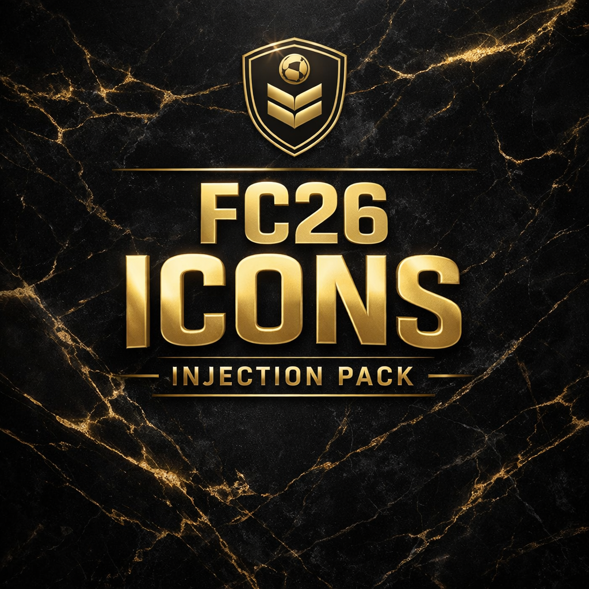

# FC26 – Heroes & Icons Injection (Live Editor)



Heroes & Icons player injection for **EA SPORTS FC 26** using **Live Editor (Lua API)**.

This repository provides a complete **Heroes & Icons injection pack** for FC 26, designed to safely add legendary players into the game without overwriting the original EA database.

All players are generated from **official EA database data**, using **DB-safe fictive player IDs** to avoid any conflict or corruption.

This project follows the same philosophy as my previous FC25 work:  
👉 https://github.com/ITRecords38/fc25-icons-injection

---

## ✅ Features

- One **`.lua` file per player**
- Players sorted by **revision**:
  - Debut Icon
  - Champion Icon
  - Heroes
- **DB-safe fictive player IDs**
- Correct **real EA Player ID** used for:
  - `real_playerid`
  - `headassetid`
- Players start their **career at 18 years old**
- Fully injected player data:
  - Nationality
  - Height
  - Weight
  - Preferred foot
  - Full stats
  - Traits
  - Workrates
  - Skill moves
  - Weak foot
- Automatic name insertion (`editedplayernames`)
- Compatible with **FC 26 Live Editor – CreatePlayer API**
- **No crashes / no desktop return** (fully tested)

---
## 📂 Structure

```text
lua_players_by_revision/
├─ Heroes/
│  ├─ 18814_Papin.lua
│  ├─ 5454_Lizarazu.lua
│  └─ ...
│
├─ Champion_Icon/
│  └─ ...
│
└─ Debut_Icon/
   └─ ...

```
🛠 Requirements

EA SPORTS FC 26 (PC)

FC 26 Live Editor

Lua scripts enabled


▶️ Usage

Extract the ZIP archive

Place the folders inside your Live Editor lua directory

Load the scripts via Live Editor

Players will appear as Free Agents


